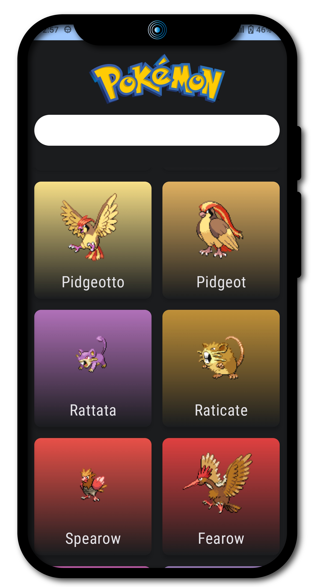
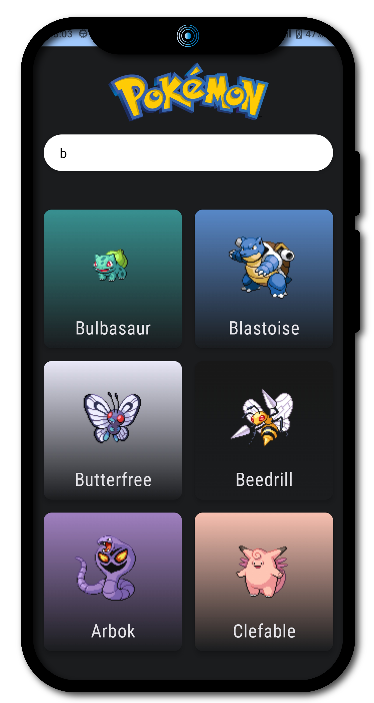
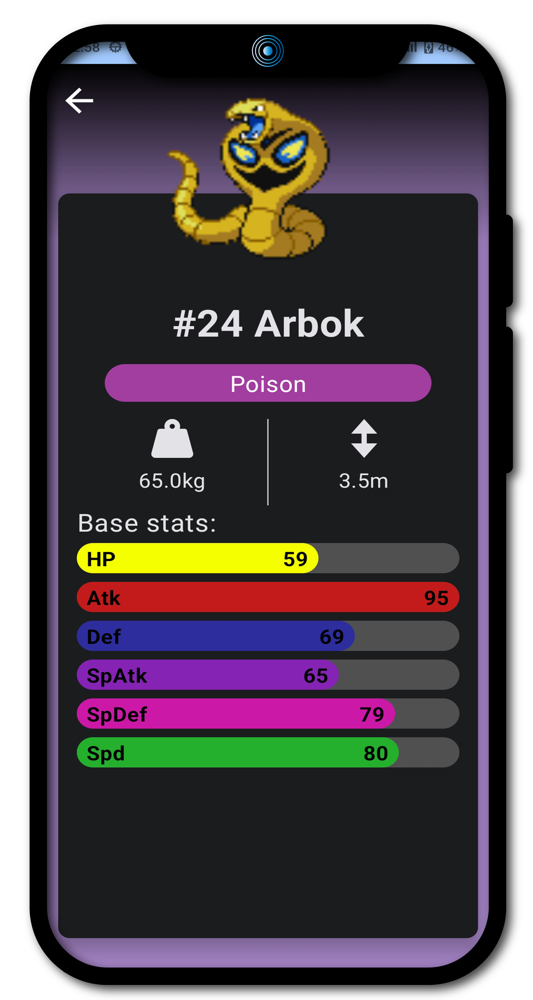

# COMPOSE POKEDEX APP : A Pokedex App build with jetpack Compose 😍 🔥 🎉

---

A Beautiful Pokedex App build with Jetpack Compose with <B>MVVM Architecture</b> 😍

# Different Screens 📱📲📳

There are mainly two different screens for the app . the first screen is for the all pokemon to
display and the second screen is for details related to each pokemon . all the screens are having
animation and nice look

<table style="width:50%">
  <tr>
    <th>
 All Pokemon  
 </th>
    <th>
 Search  Pokemon  
 </th>
    <th>
 Detailed Pokemon </th> 

  </tr>
  <tr>
    <td>
</td> 

    <td>
</td>

    <td>
</td>

  </td> 

  </tr>
</table>

---

## About 💡🎯

The Pokedex app, crafted using Jetpack Compose Material 3 and the MVVM design pattern,pagination , offers a
sleek and intuitive user interface. Leveraging the modern capabilities of Jetpack Compose, the app
provides a responsive and visually appealing experience, seamlessly adapting to various screen
sizes. The MVVM architecture ensures a clean separation of concerns, enhancing maintainability and
scalability. Users can effortlessly browse, search, and view detailed information about different
Pokémon. The app's aesthetic design, combined with robust functionality, makes it a standout tool
for Pokémon enthusiasts, providing both beauty and practicality in a single package.

---

## Build  📱

Anyone can find the working app inside the <b>Builds<b> folder 

---
## video 📺💻

https://github.com/Vibhav00/Pokedex/assets/101458238/5e8eecc2-4696-4783-a7a1-ae6c410f1a94

---
